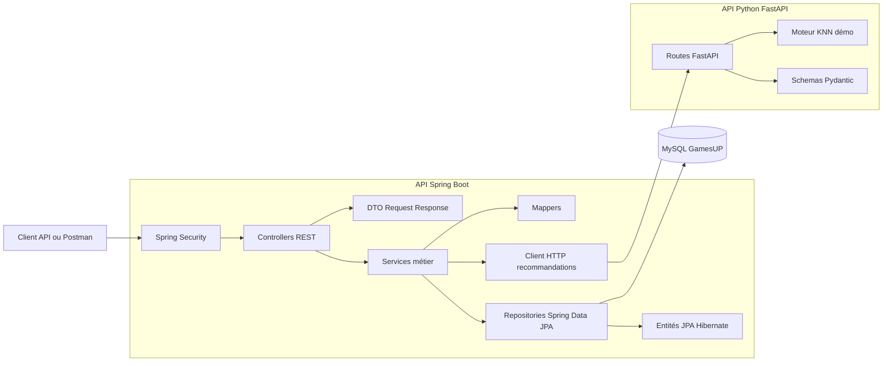
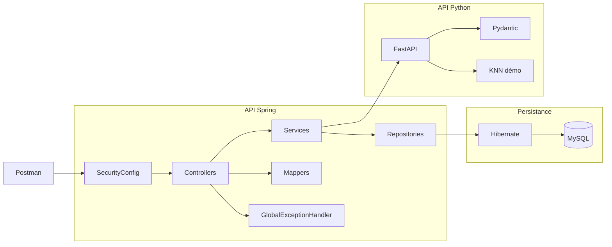
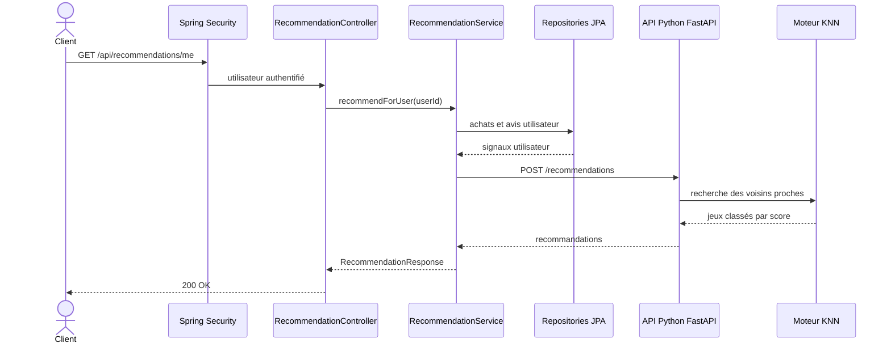
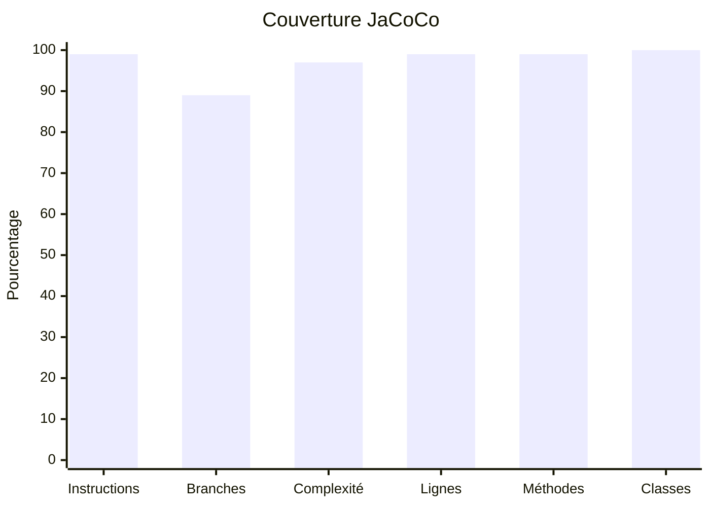

# GamesUP - Documentation livrable

## Vérification des exigences

| Exigence | État | Éléments de preuve |
| --- | --- | --- |
| Notions client, jeu, éditeur, auteur, commande | OK | Entités JPA `User`, `Game`, `Publisher`, `Author`, `Purchase`, `PurchaseLine` |
| Informations issues du code Java fourni | OK | Entités conservées et complétées : `Avis`, `Inventory`, `Wishlist`, `Category` |
| CRUD de base | OK | Controllers REST pour utilisateurs, jeux, références, commandes, avis, stocks et wishlists |
| Deux types de compte | OK | Enum `Role` avec `CLIENT` et `ADMIN` |
| Recherche sur les jeux | OK | `GameRepository.search` et `GET /api/games?search=...` |
| Architecture Spring cohérente | OK | Couches controller, service, repository, mapper, dto, model, config, exception |
| Principes SOLID | OK | Responsabilités séparées et injection par constructeurs explicites |
| Hibernate | OK | Entités `@Entity`, repositories Spring Data JPA, relations JPA |
| Spring Security | OK | `SecurityConfig`, HTTP Basic, routes publiques/client/admin |
| Tests Spring uniquement | OK | Tests MockMvc, tests d’intégration Spring, tests unitaires DTO/model |
| API Python FastAPI | OK | `CodeApiPython/main.py` |
| Modèle KNN | OK | `CodeApiPython/recommendation.py` avec voisins proches et similarité cosinus |
| Communication Spring vers Python | OK | `RecommendationService` appelle `POST /recommendations` via `RestTemplate` |
| Diagrammes | OK | Architecture, classes, composants et séquence ci-dessous |
| Rapports de couverture | OK | `gamesUP/target/site/jacoco/index.html` et `coverage-report.pdf` |

## Analyse de l’existant initial

Le projet fourni contenait déjà une base d’API Spring et une base d’API Python, mais l’architecture n’était pas encore suffisante pour répondre aux attentes du sujet.

Côté Spring, les points principaux relevés étaient :

- un accès aux données trop proche du controller ;
- une séparation insuffisante entre les responsabilités HTTP, métier et persistance ;
- des modèles Java représentant les notions métier, mais pas encore tous exploités comme entités JPA complètes ;
- peu ou pas de CRUD REST structurés ;
- pas de sécurité Spring active et donc pas de gestion claire des rôles client/administrateur ;
- une couverture de tests insuffisante ;
- pas de communication opérationnelle avec l’API Python.

Côté Python, l’API FastAPI existait, mais le système de recommandation était encore trop simplifié :

- les recommandations étaient statiques ;
- le modèle KNN n’était pas explicitement formalisé ;
- les données utiles à la recommandation n’étaient pas clairement documentées.

## Changements proposés puis réalisés

La reprise a consisté à transformer le projet en deux API cohérentes et testables.

Changements réalisés côté Spring :

- refonte en architecture REST par couches : `controller`, `service`, `repository`, `model`, `dto`, `mapper`, `config`, `exception` ;
- mise en place d’Hibernate avec des entités JPA et des relations métier ;
- création des repositories Spring Data JPA ;
- ajout des CRUD de base pour les jeux, utilisateurs, catégories, auteurs, éditeurs, commandes, avis, stocks et wishlists ;
- ajout d’une recherche sur les jeux ;
- ajout de Spring Security avec les rôles `CLIENT` et `ADMIN` ;
- ajout d’une gestion centralisée des erreurs ;
- ajout de DTO pour éviter d’exposer directement les entités ;
- ajout d’un client HTTP Spring vers l’API Python ;
- ajout de tests de non-régression, d’intégration et de contrats sur l’API Spring.

Changements réalisés côté Python :

- ajout d’un fichier de dépendances ;
- normalisation des routes FastAPI ;
- ajout d’une route de santé ;
- remplacement des recommandations statiques par un moteur KNN de démonstration ;
- documentation des données nécessaires à un futur modèle plus efficace.

Changements réalisés côté documentation et outillage :

- ajout d’une collection Postman ;
- ajout de scripts de lancement et d’arrêt à la racine ;
- ajout d’un rapport PDF de couverture ;
- ajout des diagrammes demandés ;
- ajout d’une documentation livrable séparée du journal de suivi.

## Architecture globale



## Diagramme de classes

```mermaid
classDiagram
    direction LR

    class User {
        <<Entity>>
        -Long id
        -String firstName
        -String lastName
        -String email
        -String password
        -Role role
        +getId() Long
        +getEmail() String
        +getRole() Role
    }

    class Role {
        <<enumeration>>
        CLIENT
        ADMIN
    }

    class Game {
        <<Entity>>
        -Long id
        -String name
        -String description
        -String genre
        -Integer minPlayers
        -Integer maxPlayers
        -Integer durationMinutes
        -Integer editionNumber
        -BigDecimal price
        -Category category
        -Publisher publisher
        -Set~Author~ authors
        -Inventory inventory
        +getName() String
        +getPrice() BigDecimal
    }

    class Category {
        <<Entity>>
        -Long id
        -String name
        +getName() String
    }

    class Publisher {
        <<Entity>>
        -Long id
        -String name
        +getName() String
    }

    class Author {
        <<Entity>>
        -Long id
        -String name
        -Set~Game~ games
        +getName() String
    }

    class Inventory {
        <<Entity>>
        -Long id
        -Game game
        -int quantity
        +getQuantity() int
    }

    class Purchase {
        <<Entity>>
        -Long id
        -User user
        -List~PurchaseLine~ lines
        -LocalDateTime date
        -boolean paid
        -boolean delivered
        -boolean archived
        +isPaid() boolean
        +isDelivered() boolean
        +isArchived() boolean
    }

    class PurchaseLine {
        <<Entity>>
        -Long id
        -Purchase purchase
        -Game game
        -int quantity
        -BigDecimal unitPrice
    }

    class Avis {
        <<Entity>>
        -Long id
        -String comment
        -int rating
        -User user
        -Game game
    }

    class Wishlist {
        <<Entity>>
        -Long id
        -User user
        -Set~Game~ games
    }

    class GameRequest {
        <<DTO request>>
        +String name
        +String description
        +String genre
        +Integer minPlayers
        +Integer maxPlayers
        +Integer durationMinutes
        +Integer editionNumber
        +BigDecimal price
        +Long categoryId
        +Long publisherId
        +Set~Long~ authorIds
    }

    class GameResponse {
        <<DTO response>>
        +Long id
        +String name
        +String description
        +String genre
        +Integer minPlayers
        +Integer maxPlayers
        +Integer durationMinutes
        +Integer editionNumber
        +BigDecimal price
        +ReferenceResponse category
        +ReferenceResponse publisher
        +Set~ReferenceResponse~ authors
        +Integer stockQuantity
    }

    class UserRequest {
        <<DTO request>>
        +String firstName
        +String lastName
        +String email
        +String password
        +Role role
    }

    class UserResponse {
        <<DTO response>>
        +Long id
        +String firstName
        +String lastName
        +String email
        +Role role
    }

    class ReferenceRequest {
        <<DTO request>>
        +String name
    }

    class ReferenceResponse {
        <<DTO response>>
        +Long id
        +String name
    }

    class InventoryRequest {
        <<DTO request>>
        +Long gameId
        +int quantity
    }

    class InventoryResponse {
        <<DTO response>>
        +Long id
        +Long gameId
        +String gameName
        +int quantity
    }

    class PurchaseRequest {
        <<DTO request>>
        +Long userId
        +List~PurchaseLineRequest~ lines
    }

    class PurchaseLineRequest {
        <<DTO request>>
        +Long gameId
        +int quantity
    }

    class PurchaseResponse {
        <<DTO response>>
        +Long id
        +ReferenceResponse user
        +List~PurchaseLineResponse~ lines
        +LocalDateTime date
        +boolean paid
        +boolean delivered
        +boolean archived
    }

    class PurchaseLineResponse {
        <<DTO response>>
        +Long id
        +Long gameId
        +String gameName
        +int quantity
        +BigDecimal unitPrice
    }

    class ReviewRequest {
        <<DTO request>>
        +Long userId
        +Long gameId
        +int rating
        +String comment
    }

    class ReviewResponse {
        <<DTO response>>
        +Long id
        +Long userId
        +String userEmail
        +Long gameId
        +String gameName
        +int rating
        +String comment
    }

    class WishlistRequest {
        <<DTO request>>
        +Long userId
        +Set~Long~ gameIds
    }

    class WishlistResponse {
        <<DTO response>>
        +Long id
        +ReferenceResponse user
        +Set~ReferenceResponse~ games
    }

    class RecommendationRequest {
        <<DTO request>>
        +Long userId
        +List~RecommendationPurchaseRequest~ purchases
    }

    class RecommendationPurchaseRequest {
        <<DTO request>>
        +Long gameId
        +double rating
    }

    class RecommendationResponse {
        <<DTO response>>
        +Long gameId
        +String gameName
        +double score
        +String reason
    }

    class GameController {
        <<RestController>>
        -GameService gameService
        +findAll(String) List~GameResponse~
        +findById(Long) GameResponse
        +create(GameRequest) ResponseEntity~GameResponse~
        +update(Long, GameRequest) GameResponse
        +delete(Long) ResponseEntity~Void~
    }

    class UserController {
        <<RestController>>
        -UserService userService
        +findAll() List~UserResponse~
        +me(Principal) UserResponse
        +findById(Long) UserResponse
        +create(UserRequest) ResponseEntity~UserResponse~
        +update(Long, UserRequest) UserResponse
        +delete(Long) ResponseEntity~Void~
    }

    class ReferenceController {
        <<RestController>>
        -ReferenceService referenceService
        +findCategories() List~ReferenceResponse~
        +createCategory(ReferenceRequest) ResponseEntity~ReferenceResponse~
        +updateCategory(Long, ReferenceRequest) ReferenceResponse
        +deleteCategory(Long) ResponseEntity~Void~
        +findAuthors() List~ReferenceResponse~
        +createAuthor(ReferenceRequest) ResponseEntity~ReferenceResponse~
        +updateAuthor(Long, ReferenceRequest) ReferenceResponse
        +deleteAuthor(Long) ResponseEntity~Void~
        +findPublishers() List~ReferenceResponse~
        +createPublisher(ReferenceRequest) ResponseEntity~ReferenceResponse~
        +updatePublisher(Long, ReferenceRequest) ReferenceResponse
        +deletePublisher(Long) ResponseEntity~Void~
    }

    class InventoryController {
        <<RestController>>
        -InventoryService inventoryService
        +findAll() List~InventoryResponse~
        +upsert(InventoryRequest) InventoryResponse
    }

    class PurchaseController {
        <<RestController>>
        -PurchaseService purchaseService
        +findAll(Long) List~PurchaseResponse~
        +findById(Long) PurchaseResponse
        +create(PurchaseRequest) ResponseEntity~PurchaseResponse~
        +markPaid(Long) PurchaseResponse
        +markDelivered(Long) PurchaseResponse
        +archive(Long) PurchaseResponse
    }

    class ReviewController {
        <<RestController>>
        -ReviewService reviewService
        +findAll(Long, Long) List~ReviewResponse~
        +create(ReviewRequest) ResponseEntity~ReviewResponse~
        +delete(Long) ResponseEntity~Void~
    }

    class WishlistController {
        <<RestController>>
        -WishlistService wishlistService
        +findAll() List~WishlistResponse~
        +findById(Long) WishlistResponse
        +findByUser(Long) WishlistResponse
        +create(WishlistRequest) ResponseEntity~WishlistResponse~
        +update(Long, WishlistRequest) WishlistResponse
        +delete(Long) ResponseEntity~Void~
    }

    class RecommendationController {
        <<RestController>>
        -RecommendationService recommendationService
        -UserService userService
        +recommendForCurrentUser(Principal) List~RecommendationResponse~
        +recommendForUser(Long) List~RecommendationResponse~
        +recommend(RecommendationRequest) List~RecommendationResponse~
    }

    class HealthController {
        <<RestController>>
        +root() Map
        +health() Map
    }

    class GameService {
        <<Service>>
        -GameRepository gameRepository
        -CategoryRepository categoryRepository
        -PublisherRepository publisherRepository
        -AuthorRepository authorRepository
        -GameMapper gameMapper
        +findAll(String) List~GameResponse~
        +findById(Long) GameResponse
        +create(GameRequest) GameResponse
        +update(Long, GameRequest) GameResponse
        +delete(Long) void
    }

    class UserService {
        <<Service>>
        -UserRepository userRepository
        -PasswordEncoder passwordEncoder
        +findAll() List~UserResponse~
        +findById(Long) UserResponse
        +findByEmail(String) UserResponse
        +create(UserRequest) UserResponse
        +update(Long, UserRequest) UserResponse
        +delete(Long) void
    }

    class ReferenceService {
        <<Service>>
        -CategoryRepository categoryRepository
        -AuthorRepository authorRepository
        -PublisherRepository publisherRepository
        +findCategories() List~ReferenceResponse~
        +createCategory(ReferenceRequest) ReferenceResponse
        +updateCategory(Long, ReferenceRequest) ReferenceResponse
        +deleteCategory(Long) void
        +findAuthors() List~ReferenceResponse~
        +createAuthor(ReferenceRequest) ReferenceResponse
        +updateAuthor(Long, ReferenceRequest) ReferenceResponse
        +deleteAuthor(Long) void
        +findPublishers() List~ReferenceResponse~
        +createPublisher(ReferenceRequest) ReferenceResponse
        +updatePublisher(Long, ReferenceRequest) ReferenceResponse
        +deletePublisher(Long) void
    }

    class InventoryService {
        <<Service>>
        -InventoryRepository inventoryRepository
        -GameRepository gameRepository
        +findAll() List~InventoryResponse~
        +upsert(InventoryRequest) InventoryResponse
    }

    class PurchaseService {
        <<Service>>
        -PurchaseRepository purchaseRepository
        -UserRepository userRepository
        -GameRepository gameRepository
        +findAll() List~PurchaseResponse~
        +findByUser(Long) List~PurchaseResponse~
        +findById(Long) PurchaseResponse
        +create(PurchaseRequest) PurchaseResponse
        +markPaid(Long) PurchaseResponse
        +markDelivered(Long) PurchaseResponse
        +archive(Long) PurchaseResponse
    }

    class ReviewService {
        <<Service>>
        -AvisRepository avisRepository
        -UserRepository userRepository
        -GameRepository gameRepository
        +findAll(Long, Long) List~ReviewResponse~
        +create(ReviewRequest) ReviewResponse
        +delete(Long) void
    }

    class WishlistService {
        <<Service>>
        -WishlistRepository wishlistRepository
        -UserRepository userRepository
        -GameRepository gameRepository
        +findAll() List~WishlistResponse~
        +findById(Long) WishlistResponse
        +findByUser(Long) WishlistResponse
        +create(WishlistRequest) WishlistResponse
        +update(Long, WishlistRequest) WishlistResponse
        +delete(Long) void
    }

    class RecommendationService {
        <<Service>>
        -RestTemplate restTemplate
        -UserRepository userRepository
        -PurchaseRepository purchaseRepository
        -AvisRepository avisRepository
        -String recommendationApiUrl
        +recommendForUser(Long) List~RecommendationResponse~
        +recommend(RecommendationRequest) List~RecommendationResponse~
    }

    class GameMapper {
        <<Mapper>>
        +toResponse(Game) GameResponse
        +updateEntity(Game, GameRequest) void
    }

    class JpaRepository {
        <<interface>>
    }

    class GameRepository {
        <<Repository>>
        +search(String) List~Game~
    }

    class UserRepository {
        <<Repository>>
        +findByEmail(String) Optional~User~
    }

    class CategoryRepository {
        <<Repository>>
        +findByNameIgnoreCase(String) Optional~Category~
    }

    class AuthorRepository {
        <<Repository>>
        +findByNameIgnoreCase(String) Optional~Author~
    }

    class PublisherRepository {
        <<Repository>>
        +findByNameIgnoreCase(String) Optional~Publisher~
    }

    class InventoryRepository {
        <<Repository>>
        +findByGameId(Long) Optional~Inventory~
    }

    class PurchaseRepository {
        <<Repository>>
        +findByUserId(Long) List~Purchase~
    }

    class AvisRepository {
        <<Repository>>
        +findByGameId(Long) List~Avis~
        +findByUserId(Long) List~Avis~
    }

    class WishlistRepository {
        <<Repository>>
        +findByUserId(Long) Optional~Wishlist~
    }

    class SecurityConfig {
        <<Configuration>>
        +securityFilterChain(HttpSecurity) SecurityFilterChain
    }

    class ApplicationConfig {
        <<Configuration>>
        +passwordEncoder() PasswordEncoder
        +restTemplate() RestTemplate
    }

    class DataSeeder {
        <<Configuration>>
        +seedData() CommandLineRunner
    }

    class GlobalExceptionHandler {
        <<ControllerAdvice>>
        +handleNotFound(ResourceNotFoundException) ResponseEntity
        +handleConflict(ConflictException) ResponseEntity
        +handleValidation(MethodArgumentNotValidException) ResponseEntity
        +handleGeneric(Exception) ResponseEntity
    }

    class ResourceNotFoundException {
        <<Exception>>
        +ResourceNotFoundException(String)
    }

    class ConflictException {
        <<Exception>>
        +ConflictException(String)
    }

    User --> Role
    User "1" --> "0..*" Purchase : passe
    User "1" --> "0..*" Avis : rédige
    User "1" --> "0..1" Wishlist : possède
    Game "0..*" --> "0..1" Category : appartient à
    Game "0..*" --> "0..1" Publisher : édité par
    Game "0..*" --> "0..*" Author : créé par
    Author "0..*" --> "0..*" Game : participe à
    Game "1" --> "0..1" Inventory : stock
    Game "1" --> "0..*" Avis : reçoit
    Purchase "1" --> "1..*" PurchaseLine : contient
    PurchaseLine "0..*" --> "1" Game : concerne
    Wishlist "0..*" --> "0..*" Game : contient

    GameRequest ..> Game : alimente
    UserRequest ..> User : alimente
    ReferenceRequest ..> Category : alimente
    ReferenceRequest ..> Author : alimente
    ReferenceRequest ..> Publisher : alimente
    InventoryRequest ..> Inventory : alimente
    PurchaseRequest ..> Purchase : alimente
    PurchaseRequest ..> PurchaseLineRequest : contient
    ReviewRequest ..> Avis : alimente
    WishlistRequest ..> Wishlist : alimente
    RecommendationRequest ..> RecommendationPurchaseRequest : contient
    RecommendationRequest ..> RecommendationResponse : produit

    GameResponse ..> Game : expose
    GameResponse ..> ReferenceResponse : compose
    UserResponse ..> User : expose
    InventoryResponse ..> Inventory : expose
    PurchaseResponse ..> Purchase : expose
    PurchaseResponse ..> PurchaseLineResponse : contient
    PurchaseResponse ..> ReferenceResponse : compose
    ReviewResponse ..> Avis : expose
    WishlistResponse ..> Wishlist : expose
    WishlistResponse ..> ReferenceResponse : compose

    GameController --> GameService
    UserController --> UserService
    ReferenceController --> ReferenceService
    InventoryController --> InventoryService
    PurchaseController --> PurchaseService
    ReviewController --> ReviewService
    WishlistController --> WishlistService
    RecommendationController --> RecommendationService
    RecommendationController --> UserService

    GameService --> GameRepository
    GameService --> CategoryRepository
    GameService --> PublisherRepository
    GameService --> AuthorRepository
    GameService --> GameMapper
    UserService --> UserRepository
    ReferenceService --> CategoryRepository
    ReferenceService --> AuthorRepository
    ReferenceService --> PublisherRepository
    InventoryService --> InventoryRepository
    InventoryService --> GameRepository
    PurchaseService --> PurchaseRepository
    PurchaseService --> UserRepository
    PurchaseService --> GameRepository
    ReviewService --> AvisRepository
    ReviewService --> UserRepository
    ReviewService --> GameRepository
    WishlistService --> WishlistRepository
    WishlistService --> UserRepository
    WishlistService --> GameRepository
    RecommendationService --> UserRepository
    RecommendationService --> PurchaseRepository
    RecommendationService --> AvisRepository

    GameMapper ..> Game
    GameMapper ..> GameRequest
    GameMapper ..> GameResponse
    SecurityConfig ..> UserRepository
    ApplicationConfig ..> UserRepository
    DataSeeder ..> UserRepository
    DataSeeder ..> GameRepository
    GlobalExceptionHandler ..> ResourceNotFoundException
    GlobalExceptionHandler ..> ConflictException

    GameRepository --|> JpaRepository
    UserRepository --|> JpaRepository
    CategoryRepository --|> JpaRepository
    AuthorRepository --|> JpaRepository
    PublisherRepository --|> JpaRepository
    InventoryRepository --|> JpaRepository
    PurchaseRepository --|> JpaRepository
    AvisRepository --|> JpaRepository
    WishlistRepository --|> JpaRepository
```

## Diagramme de composants



## Diagramme de séquence - recommandation



## Respect des principes SOLID

- Responsabilité unique : les controllers exposent HTTP, les services portent la logique métier, les repositories gèrent la persistance et les DTO définissent les contrats JSON.
- Ouvert/fermé : l’ajout de `WishlistController` et `WishlistService` a été fait sans modifier les controllers existants.
- Substitution de Liskov : les repositories respectent les contrats Spring Data JPA.
- Ségrégation des interfaces : les services exposent des méthodes ciblées par domaine au lieu d’un service global.
- Inversion des dépendances : les composants dépendent de repositories, services et clients injectés par constructeurs explicites.

## Bonnes pratiques appliquées

- Architecture en couches et DTO pour éviter d’exposer directement les entités.
- Gestion centralisée des erreurs avec `GlobalExceptionHandler`.
- Validation des entrées avec Jakarta Validation.
- Sécurité par rôles `CLIENT` et `ADMIN`.
- Tests de non-régression Spring avec MockMvc et base H2.
- Configuration Docker et scripts racine pour faciliter le lancement.
- Suppression de la dépendance implicite à Lombok dans le code principal afin d’éviter les erreurs IDE.

## Points perfectibles

- HTTP Basic est suffisant pour l’exercice, mais JWT serait plus adapté à une application front moderne.
- Le KNN utilise un jeu de données de démonstration, pas un entraînement sur données réelles.
- Les données ML historiques ne sont pas disponibles, donc les features sont simulées.
- Les tests Python ne sont pas ajoutés car la consigne demande de tester uniquement l’API Spring.

## Système de recommandation

Spring construit des signaux utilisateur avec :

- achats passés ;
- jeux achetés ;
- notes et avis ;
- identifiant utilisateur.

L’API Python reçoit :

```json
{
  "userId": 1,
  "purchases": [
    {
      "gameId": 102,
      "rating": 4.5
    }
  ]
}
```

Le moteur Python construit un profil moyen pondéré par les notes, exclut les jeux déjà achetés, puis retourne les `k` jeux les plus proches. Les features de démonstration représentent la coopération, la complexité, la stratégie et l’accessibilité familiale.

Données utiles pour un futur modèle efficace :

- historique d’achats ;
- notes utilisateurs ;
- wishlists ;
- catégories préférées ;
- auteurs et éditeurs préférés ;
- durée, nombre de joueurs, prix ;
- interactions de consultation ou d’ajout panier si elles existent plus tard.

## Couverture de test

Dernière vérification :

```powershell
cd gamesUP
.\mvnw.cmd clean test
```

Résultat :

- Build Spring : succès.
- Tests Spring : 19 tests, 0 échec.
- Couverture JaCoCo instructions : 99 pourcent.
- Couverture JaCoCo branches : 89 pourcent.
- Couverture JaCoCo classes : 100 pourcent.

Rapports :

- Rapport JaCoCo : `gamesUP/target/site/jacoco/index.html`.
- Rapport PDF : `coverage-report.pdf`.

### Rapport visuel intégré

| Métrique JaCoCo | Couverture | Détail |
| --- | ---: | --- |
| Instructions | 99 % | 8 instructions non couvertes sur 3 132 |
| Branches | 89 % | 6 branches non couvertes sur 56 |
| Complexité | 97 % | 7 points de complexité non couverts sur 342 |
| Lignes | 99 % | 2 lignes non couvertes sur 708 |
| Méthodes | 99 % | 1 méthode non couverte sur 314 |
| Classes | 100 % | 56 classes couvertes sur 56 |



Lecture du rapport :

- les couches `controller`, `dto`, `mapper`, `model` et `exception` sont couvertes à 100 % ;
- la couche `service` est couverte à 99 % ;
- la couverture restante non atteinte correspond principalement à des chemins techniques ou branches de configuration ;
- le seuil demandé de 70 % est largement dépassé.
