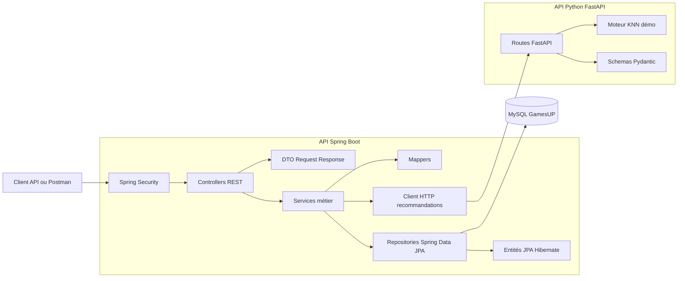
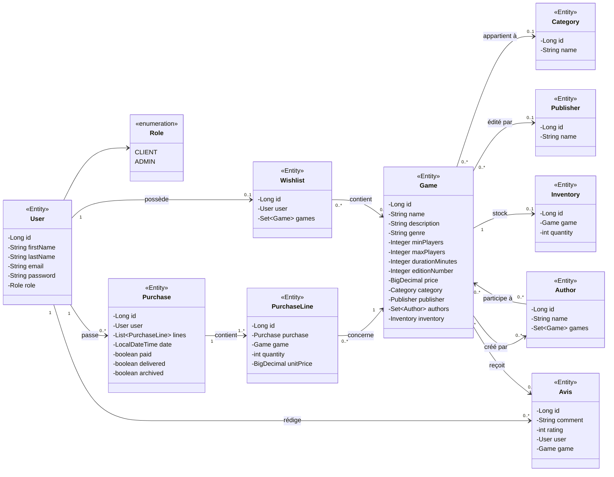
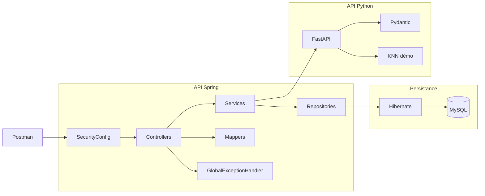
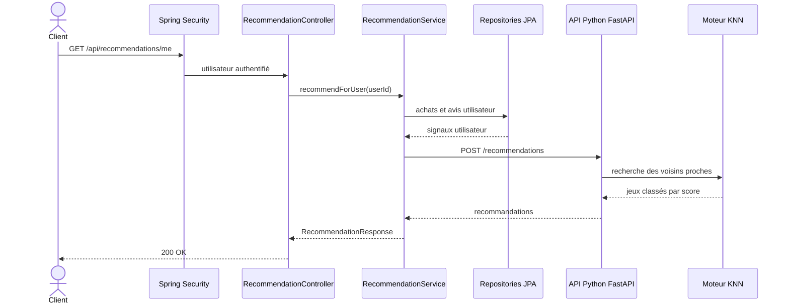
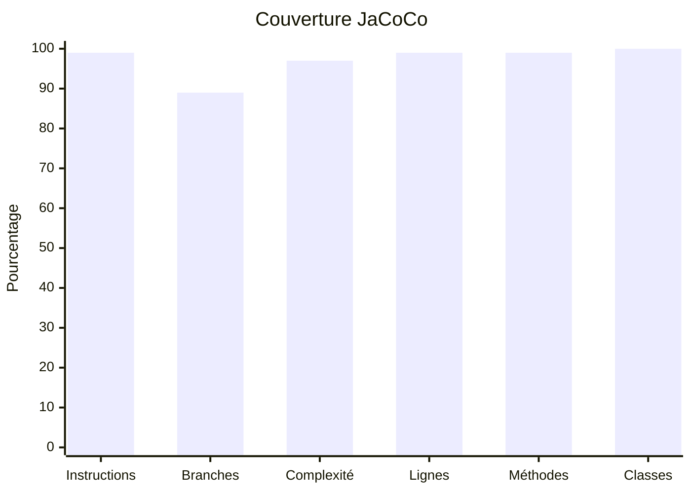

# GamesUP - Documentation livrable

## Vérification des exigences

| Exigence | État | Éléments de preuve |
| --- | --- | --- |
| Notions client, jeu, éditeur, auteur, commande | OK | Entités JPA `User`, `Game`, `Publisher`, `Author`, `Purchase`, `PurchaseLine` |
| Informations issues du code Java fourni | OK | Entités conservées et complétées : `Avis`, `Inventory`, `Wishlist`, `Category` |
| CRUD de base | OK | Controllers REST pour utilisateurs, jeux, références, commandes, avis, stocks et wishlists |
| Deux types de compte | OK | Enum `Role` avec `CLIENT` et `ADMIN` |
| Recherche sur les jeux | OK | `GameRepository.search` et `GET /api/games?search=...` |
| Architecture Spring cohérente | OK | Couches controller, service, repository, mapper, dto, model, config, exception |
| Principes SOLID | OK | Responsabilités séparées et injection par constructeurs explicites |
| Hibernate | OK | Entités `@Entity`, repositories Spring Data JPA, relations JPA |
| Spring Security | OK | `SecurityConfig`, HTTP Basic, routes publiques/client/admin |
| Tests Spring uniquement | OK | Tests MockMvc, tests d’intégration Spring, tests unitaires DTO/model |
| API Python FastAPI | OK | `CodeApiPython/main.py` |
| Modèle KNN | OK | `CodeApiPython/recommendation.py` avec voisins proches et similarité cosinus |
| Communication Spring vers Python | OK | `RecommendationService` appelle `POST /recommendations` via `RestTemplate` |
| Diagrammes | OK | Architecture, classes, composants et séquence ci-dessous |
| Rapports de couverture | OK | `gamesUP/target/site/jacoco/index.html` et `coverage-report.pdf` |

## Analyse de l’existant initial

Le projet fourni contenait déjà une base d’API Spring et une base d’API Python, mais l’architecture n’était pas encore suffisante pour répondre aux attentes du sujet.

Côté Spring, les points principaux relevés étaient :

- un accès aux données trop proche du controller ;
- une séparation insuffisante entre les responsabilités HTTP, métier et persistance ;
- des modèles Java représentant les notions métier, mais pas encore tous exploités comme entités JPA complètes ;
- peu ou pas de CRUD REST structurés ;
- pas de sécurité Spring active et donc pas de gestion claire des rôles client/administrateur ;
- une couverture de tests insuffisante ;
- pas de communication opérationnelle avec l’API Python.

Côté Python, l’API FastAPI existait, mais le système de recommandation était encore trop simplifié :

- les recommandations étaient statiques ;
- le modèle KNN n’était pas explicitement formalisé ;
- les données utiles à la recommandation n’étaient pas clairement documentées.

## Changements proposés puis réalisés

La reprise a consisté à transformer le projet en deux API cohérentes et testables.

Changements réalisés côté Spring :

- refonte en architecture REST par couches : `controller`, `service`, `repository`, `model`, `dto`, `mapper`, `config`, `exception` ;
- mise en place d’Hibernate avec des entités JPA et des relations métier ;
- création des repositories Spring Data JPA ;
- ajout des CRUD de base pour les jeux, utilisateurs, catégories, auteurs, éditeurs, commandes, avis, stocks et wishlists ;
- ajout d’une recherche sur les jeux ;
- ajout de Spring Security avec les rôles `CLIENT` et `ADMIN` ;
- ajout d’une gestion centralisée des erreurs ;
- ajout de DTO pour éviter d’exposer directement les entités ;
- ajout d’un client HTTP Spring vers l’API Python ;
- ajout de tests de non-régression, d’intégration et de contrats sur l’API Spring.

Changements réalisés côté Python :

- ajout d’un fichier de dépendances ;
- normalisation des routes FastAPI ;
- ajout d’une route de santé ;
- remplacement des recommandations statiques par un moteur KNN de démonstration ;
- documentation des données nécessaires à un futur modèle plus efficace.

Changements réalisés côté documentation et outillage :

- ajout d’une collection Postman ;
- ajout de scripts de lancement et d’arrêt à la racine ;
- ajout d’un rapport PDF de couverture ;
- ajout des diagrammes demandés ;
- ajout d’une documentation livrable séparée du journal de suivi.

## Architecture globale



## Diagramme de classes



Ce diagramme se concentre volontairement sur les classes métier persistées et leurs relations JPA. Il montre les entités `User`, `Role`, `Game`, `Category`, `Publisher`, `Author`, `Purchase`, `PurchaseLine`, `Wishlist`, `Avis` et `Inventory`, ainsi que les cardinalités Hibernate principales : utilisateur-commandes, utilisateur-avis, utilisateur-wishlist, jeu-catégorie, jeu-éditeur, jeu-auteurs, jeu-stock, commande-lignes, avis utilisateur/jeu et wishlist-jeux.

## Diagramme de composants



## Diagramme de séquence - recommandation



## Respect des principes SOLID

- Responsabilité unique : les controllers exposent HTTP, les services portent la logique métier, les repositories gèrent la persistance et les DTO définissent les contrats JSON.
- Ouvert/fermé : l’ajout de `WishlistController` et `WishlistService` a été fait sans modifier les controllers existants.
- Substitution de Liskov : les repositories respectent les contrats Spring Data JPA.
- Ségrégation des interfaces : les services exposent des méthodes ciblées par domaine au lieu d’un service global.
- Inversion des dépendances : les composants dépendent de repositories, services et clients injectés par constructeurs explicites.

## Bonnes pratiques appliquées

- Architecture en couches et DTO pour éviter d’exposer directement les entités.
- Gestion centralisée des erreurs avec `GlobalExceptionHandler`.
- Validation des entrées avec Jakarta Validation.
- Sécurité par rôles `CLIENT` et `ADMIN`.
- Tests de non-régression Spring avec MockMvc et base H2.
- Configuration Docker et scripts racine pour faciliter le lancement.
- Suppression de la dépendance implicite à Lombok dans le code principal afin d’éviter les erreurs IDE.

## Points perfectibles

- HTTP Basic est suffisant pour l’exercice, mais JWT serait plus adapté à une application front moderne.
- Le KNN utilise un jeu de données de démonstration, pas un entraînement sur données réelles.
- Les données ML historiques ne sont pas disponibles, donc les features sont simulées.
- Les tests Python ne sont pas ajoutés car la consigne demande de tester uniquement l’API Spring.

## Système de recommandation

Spring construit des signaux utilisateur avec :

- achats passés ;
- jeux achetés ;
- notes et avis ;
- identifiant utilisateur.

L’API Python reçoit :

```json
{
  "userId": 1,
  "purchases": [
    {
      "gameId": 102,
      "rating": 4.5
    }
  ]
}
```

Le moteur Python construit un profil moyen pondéré par les notes, exclut les jeux déjà achetés, puis retourne les `k` jeux les plus proches. Les features de démonstration représentent la coopération, la complexité, la stratégie et l’accessibilité familiale.

Données utiles pour un futur modèle efficace :

- historique d’achats ;
- notes utilisateurs ;
- wishlists ;
- catégories préférées ;
- auteurs et éditeurs préférés ;
- durée, nombre de joueurs, prix ;
- interactions de consultation ou d’ajout panier si elles existent plus tard.

## Couverture de test

Dernière vérification :

```powershell
cd gamesUP
.\mvnw.cmd clean test
```

Résultat :

- Build Spring : succès.
- Tests Spring : 19 tests, 0 échec.
- Couverture JaCoCo instructions : 99 pourcent.
- Couverture JaCoCo branches : 89 pourcent.
- Couverture JaCoCo classes : 100 pourcent.

Rapports :

- Rapport JaCoCo : `gamesUP/target/site/jacoco/index.html`.
- Rapport PDF : `coverage-report.pdf`.

### Rapport visuel intégré

| Métrique JaCoCo | Couverture | Détail |
| --- | ---: | --- |
| Instructions | 99 % | 8 instructions non couvertes sur 3 132 |
| Branches | 89 % | 6 branches non couvertes sur 56 |
| Complexité | 97 % | 7 points de complexité non couverts sur 342 |
| Lignes | 99 % | 2 lignes non couvertes sur 708 |
| Méthodes | 99 % | 1 méthode non couverte sur 314 |
| Classes | 100 % | 56 classes couvertes sur 56 |



Lecture du rapport :

- les couches `controller`, `dto`, `mapper`, `model` et `exception` sont couvertes à 100 % ;
- la couche `service` est couverte à 99 % ;
- la couverture restante non atteinte correspond principalement à des chemins techniques ou branches de configuration ;
- le seuil demandé de 70 % est largement dépassé.
