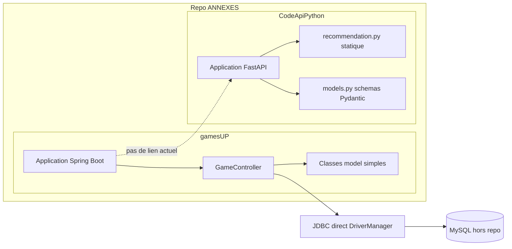
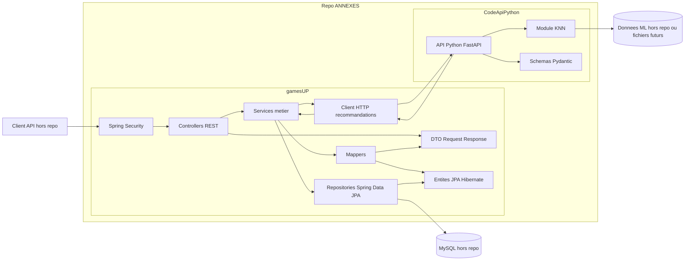
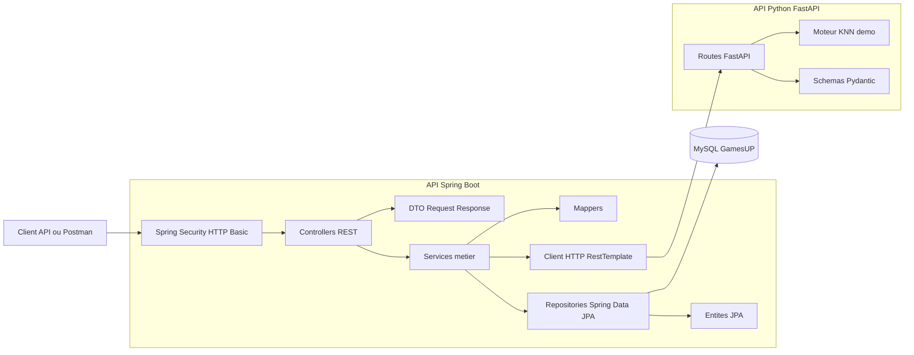
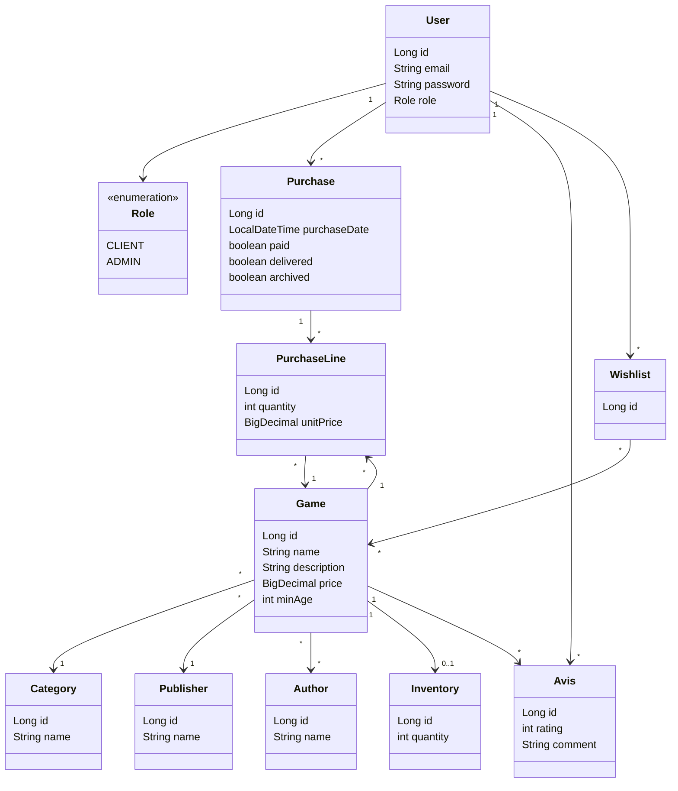
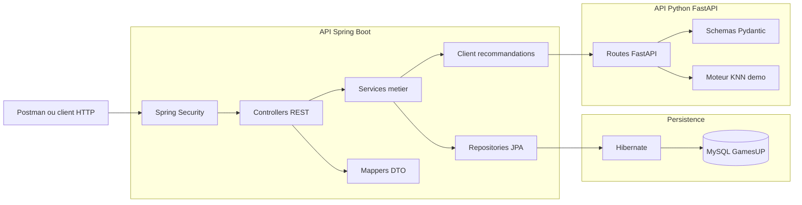
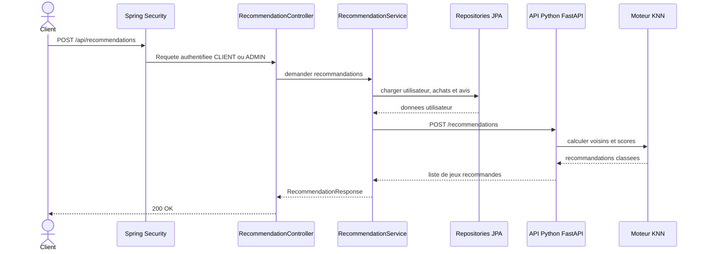

# GamesUP - Suivi de l'exercice

## Regles de travail

- Aucun commit ne sera fait sans demande explicite.
- Le README est mis a jour a chaque etape.
- Le texte du README est ecrit sans accents.
- Chaque etape doit etre verifiee avant de passer a la suivante.
- A chaque reprise de travail, relire ce README avant toute modification.
- A chaque reprise de travail, reprendre en compte les deux PDF de consignes fournis par l'utilisateur comme sources de reference.
- Si les deux PDF ne sont pas accessibles dans le dossier du projet, demander a l'utilisateur de les remettre avant de prendre une decision qui depend des consignes.

## Fichiers de consignes de reference

Les deux PDF de consignes transmis par l'utilisateur doivent etre consideres comme les sources prioritaires du sujet.

Etat actuel :

- PDF de consignes 1 : `Enonce_Etude-de-cas-GamesUP.pdf`, present dans le dossier du projet.
- PDF de consignes 2 : `FT_Etude-de-cas-GamesUP.pdf`, present dans le dossier du projet.

Regle de reprise :

- Ne pas se baser uniquement sur la memoire de session pour les exigences du sujet.
- Repartir du README puis verifier les deux PDF avant les etapes importantes : architecture, securite, tests, communication Spring/Python, documentation finale.

Synthese des consignes verifiees dans les PDF :

- Fournir une API Spring completee.
- Fournir une API Python completee.
- Fournir une documentation complete.
- Refondre l'API Spring avec une architecture REST coherente et les principes SOLID.
- Mettre en place Hibernate.
- Ajouter les CRUD de base.
- Ajouter une recherche sur les jeux.
- Mettre en place Spring Security.
- Gerer deux roles : CLIENT et ADMIN.
- Fournir des tests unitaires et des tests d'integration pour l'API Spring.
- Atteindre au moins 70 pourcent de couverture.
- Completer l'API Python avec un algorithme ML KNN, meme non entraine.
- Faire communiquer l'API Spring avec l'API Python pour envoyer des donnees utilisateur et recevoir des recommandations.
- Fournir les diagrammes d'architecture, de classes, de composants et de sequence.

## Etape 1 - Audit initial

Statut : realisee

Objectif :

- Lire les consignes du sujet.
- Identifier les versions demandees ou declarees par le projet.
- Auditer rapidement l'API Spring existante.
- Auditer rapidement l'API Python existante.
- Lister les manques principaux avant refonte.

## Etape 2 - Refonte API Spring

Statut : realisee

Objectif :

- Valider et stabiliser l'architecture Spring existante.
- Verifier la presence d'un modele JPA/Hibernate coherent.
- Conserver une separation propre entre controller / service / repository / mapper.
- Maintenir les DTOs pour l'API publique.
- Identifier les points restant pour l'etape suivante.

Resultats :

- L'API Spring est structuree en couches et utilise Hibernate via Spring Data JPA.
- La recherche de jeux est deja implantee dans `GameRepository.search`.
- Un handler global d'exceptions est present.
- La securite reste a activer et les roles a configurer en etape 3.
- Les tests existent mais doivent etre enrichis et couverts.

## Versions detectees

### API Spring

- Java : 21
- Spring Boot : 3.3.4
- Maven wrapper : 3.3.2
- Maven distribue par le wrapper : 3.9.9
- Packaging : Maven
- Nom de l'application : gamesUP
- Port serveur declare : 8080
- Base de donnees declaree : MySQL
- URL JDBC declaree : jdbc:mysql://${MYSQL_HOST:localhost}:3306/GamesUP
- Driver JDBC : com.mysql.cj.jdbc.Driver

Dependances declarees dans le `pom.xml` :

- spring-boot-starter-web
- spring-boot-starter-data-jpa
- mysql-connector-j
- lombok
- spring-boot-starter-test
- spring-security-test

Point important :

- spring-boot-starter-security est present dans le `pom.xml`, mais il est commente.
- Spring Security n'est donc pas encore actif dans l'application.

### API Python

Fichiers presents :

- main.py
- models.py
- recommendation.py
- data_loader.py
- readme.md

Librairies importees dans le code :

- fastapi
- pydantic
- pandas

Point important :

- Aucun fichier `requirements.txt`, `pyproject.toml`, `Pipfile` ou `poetry.lock` n'a ete trouve.
- Les versions Python exactes ne sont donc pas declarees par le projet.
- Une etape future devra ajouter un fichier de dependances pour figer les versions.

## Etat actuel de l'API Spring

Structure constatee :

- Une classe principale `GamesUpApplication`.
- Un controller `GameController`.
- Des classes dans le package `model`.
- Un seul test de demarrage `contextLoads`.

Problemes principaux constates :

- `GameController` n'a pas d'annotation `@RestController`.
- `GameController` n'a pas de route racine `@RequestMapping`.
- Le controller utilise JDBC en dur avec `DriverManager`.
- Les identifiants base de donnees sont ecrits directement dans le code.
- Le controller contourne Spring Data JPA et Hibernate.
- Les classes modeles ne sont pas annotees avec `@Entity`.
- Les relations entre modeles ne sont pas definies avec JPA.
- Les champs sont souvent publics ou sans getters/setters coherents.
- Aucun repository Spring Data n'est present.
- Aucun service metier n'est present.
- Aucun DTO n'est present.
- Aucune gestion globale des erreurs n'est presente.
- La securite n'est pas en place.
- La gestion des roles client/admin n'est pas en place.
- Les tests sont quasi inexistants.

Modeles presents :

- Author
- Avis
- Category
- Game
- Inventory
- Publisher
- Purchase
- PurchaseLine
- User
- Wishlist

## Etat actuel de l'API Python

Structure constatee :

- Une application FastAPI est creee dans `main.py`.
- Une route `GET /` retourne un message de test.
- Une route `POST /recommendations/` appelle `generate_recommendations`.
- Les donnees utilisateur sont decrites avec Pydantic dans `models.py`.
- `recommendation.py` retourne actuellement une liste statique de jeux.
- `data_loader.py` charge un fichier CSV avec pandas.

Problemes principaux constates :

- Aucun algorithme KNN n'est implemente.
- Les recommandations sont statiques.
- Les donnees necessaires au modele ML ne sont pas encore formalisees.
- Aucun fichier de dependances Python n'est present.
- Aucune route de sante technique detaillee n'est presente.
- L'API Spring ne communique pas encore avec l'API Python.

## Exigences du sujet a couvrir

- Fournir une API Spring completee.
- Fournir une API Python completee.
- Fournir une documentation complete.
- Refondre l'API Spring avec une architecture coherente.
- Respecter les principes SOLID.
- Mettre en place Hibernate.
- Ajouter les CRUD de base.
- Ajouter une recherche sur les jeux.
- Ajouter Spring Security.
- Ajouter les roles CLIENT et ADMIN.
- Ajouter des tests unitaires et des tests d'integration.
- Viser au moins 70 pourcent de couverture.
- Completer l'API Python avec un algorithme ML KNN.
- Faire communiquer Spring avec Python.
- Produire les diagrammes suivants :
  - diagramme d'architecture
  - diagramme de classes
  - diagramme de composants
  - diagramme de sequence

## Etape 1 bis - Analyse detaillee de l'existant et architecture cible

Statut : realisee

Objectif :

- Approfondir l'analyse de l'existant avant modification du code.
- Produire un diagramme de l'architecture actuelle.
- Produire un diagramme de l'architecture cible proposee.
- Identifier clairement les ecarts entre le code actuel et les attentes du sujet.

## Verification technique de l'existant

Commande lancee :

```bash
./mvnw.cmd test
```

Resultat :

- Le build echoue avant l'execution des tests.
- Cause : le projet demande Java 21, mais le JDK actif est Java 17.
- Message Maven principal : `release version 21 not supported`.

Versions locales relevees :

- java : 17.0.12
- javac : 17.0.12
- python : 3.12.1

Constat Python local :

- `fastapi` n'est pas installe dans l'environnement Python actif.
- Les versions de `fastapi`, `pydantic` et `pandas` ne peuvent donc pas etre confirmees localement.
- Le projet Python devra fournir un fichier de dependances avant execution fiable.

## Responsabilites actuelles par fichier

### API Spring

- `GamesUpApplication.java` : point d'entree Spring Boot.
- `GameController.java` : tente de fournir un acces aux jeux, mais utilise JDBC directement et n'est pas expose comme controller REST Spring.
- `Author.java` : modele simple pour un auteur, sans JPA.
- `Avis.java` : modele simple pour un avis, sans JPA.
- `Category.java` : modele simple pour une categorie, sans JPA.
- `Game.java` : modele simple pour un jeu, sans JPA, avec auteur stocke en texte.
- `Inventory.java` : stock represente par une `HashMap<Game, Integer>`, non persistant.
- `Publisher.java` : modele simple pour un editeur, sans JPA.
- `Purchase.java` : modele simple pour une commande, sans JPA.
- `PurchaseLine.java` : modele simple pour une ligne de commande, sans JPA.
- `User.java` : modele simple pour un utilisateur, sans JPA.
- `Wishlist.java` : classe vide.
- `GamesUpApplicationTests.java` : test minimal de chargement de contexte.

### API Python

- `main.py` : cree l'application FastAPI et expose les routes `/` et `/recommendations/`.
- `models.py` : definit les schemas Pydantic `UserPurchase` et `UserData`.
- `recommendation.py` : retourne des recommandations statiques.
- `data_loader.py` : charge un fichier CSV avec pandas.
- `readme.md` : fichier vide.

## Ecarts principaux avec les attentes du sujet

### Architecture

- Le code Spring n'est pas organise en couches.
- La logique d'acces aux donnees est dans le controller.
- Aucune couche service ne porte les regles metier.
- Aucune couche repository ne gere la persistence.
- Aucun DTO ne separe l'API publique des entites internes.
- Aucun mapper ne gere la transformation entre DTO et entites.
- Aucune gestion centralisee des erreurs n'est presente.

### Persistence

- Hibernate est declare via `spring-boot-starter-data-jpa`, mais il n'est pas utilise dans le code.
- Les modeles ne sont pas des entites JPA.
- Les relations metier ne sont pas modelisees.
- Le controller utilise une URL JDBC differente de celle du fichier `application.properties`.
- La base est nommee `GamesUP` dans `application.properties`, mais `gameUP` dans le controller.

### API REST

- Le controller actuel ne respecte pas une structure REST complete.
- Seules deux operations partielles existent pour les jeux.
- Les CRUD attendus ne sont pas presents.
- La recherche de jeux n'est pas presente.

### Securite

- Spring Security n'est pas actif.
- Aucun mecanisme d'authentification n'est present.
- Les roles CLIENT et ADMIN ne sont pas presents.
- Les routes ne sont pas protegees.

### Tests

- Le test existant ne valide aucune fonctionnalite metier.
- Aucun test de controller n'est present.
- Aucun test de service n'est present.
- Aucun objectif de couverture n'est configure.

### Recommandation

- L'API Python n'implemente pas encore le KNN.
- Les recommandations sont statiques.
- L'API Spring ne consomme pas encore l'API Python.
- Les donnees utiles au modele ne sont pas encore definies.

## Perimetre reel du repo

Elements presents dans le repo :

- `gamesUP` : API Spring Boot.
- `CodeApiPython` : API Python FastAPI.
- `README.md` : suivi de l'exercice et documentation.

Elements mentionnes par le sujet mais absents du repo :

- Front Angular.
- Base MySQL reelle avec schema et donnees.
- Jeux de donnees exploitables pour entrainer le modele de recommandation.

Decision de documentation :

- Les diagrammes doivent montrer en priorite les elements presents dans le repo.
- Les elements externes ou supposes seront marques comme hors repo.

## Diagramme de l'architecture existante du repo



Lecture du diagramme :

- L'API Spring actuelle ne possede pas de couches service et repository.
- Le controller accede directement a MySQL.
- Les classes modeles ne sont pas persistantes.
- L'API Python existe a cote, mais elle n'est pas appelee par Spring.
- Le module de recommandation Python retourne des donnees fixes.
- Le front Angular est absent du repo, donc il n'est pas affiche dans l'existant.

## Diagramme de l'architecture cible proposee pour le repo



Lecture du diagramme :

- Le client API est hors repo. Dans le sujet, il correspond au front Angular deja existant.
- Spring Security gere l'authentification et les roles.
- Les controllers exposent les endpoints REST.
- Les DTO evitent d'exposer les entites directement.
- Les services portent la logique metier.
- Les repositories gerent la persistence via Spring Data JPA.
- Hibernate mappe les entites vers MySQL.
- Un client HTTP Spring communique avec l'API Python.
- FastAPI porte le module de recommandation KNN.

## Architecture cible par couches

- `controller` : endpoints REST.
- `dto` : objets d'entree et de sortie de l'API.
- `service` : logique metier.
- `repository` : acces aux donnees avec Spring Data JPA.
- `model` : entites JPA.
- `mapper` : transformation entre entites et DTO.
- `exception` : erreurs metier et gestion globale.
- `config` : securite, clients HTTP et configuration technique.

## Decisions proposees avant implementation

- Conserver le socle Spring Boot 3.3.4.
- Conserver Java 21 car il est declare dans le sujet technique du projet.
- Installer ou utiliser un JDK 21 pour compiler.
- Ajouter un fichier de dependances Python.
- Utiliser Mermaid pour les diagrammes dans la documentation.
- Faire la refonte par petits blocs validables.

## Plan propose apres audit

### Etape 2 - Refonte architecture Spring

Statut : en cours

Verification du 10/05/2026 :

- L'etape 2 a bien ete commencee dans le code.
- Les packages `repository`, `service`, `dto`, `mapper`, `exception` et `config` existent.
- Les modeles principaux ont ete transformes en entites JPA avec `@Entity`.
- Les repositories Spring Data JPA existent pour les modeles principaux.
- Un `GameService` existe.
- Un `GameController` REST existe avec la route racine `/api/games`.
- Des DTO `GameRequest`, `GameResponse` et `ReferenceResponse` existent.
- Un `GameMapper` existe.
- Une gestion globale d'erreur existe avec `GlobalExceptionHandler`.
- Une recherche de jeux existe deja dans `GameRepository`.

Verification technique du 10/05/2026 :

- `java -version` retourne Java 17.0.12.
- `javac -version` retourne javac 17.0.12.
- `./mvnw.cmd test` echoue car le projet compile en Java 21 et le JDK actif est Java 17.
- Message principal : `release version 21 not supported`.
- Il faut installer ou activer un JDK 21 pour valider la compilation et les tests.

Reste a faire pour finaliser cette etape :

- Verifier toutes les relations JPA entre les entites.
- Verifier que les entites couvrent bien client, jeu, editeur, auteur, commande, avis, stock et wishlist.
- Ajouter ou completer les services metier manquants au-dela de `GameService`.
- Ajouter ou completer les controllers REST manquants au-dela de `GameController`.
- Ajouter les validations d'entree si necessaire.
- Compiler avec JDK 21 pour detecter les erreurs restantes.

- Creer les packages manquants : repository, service, dto, mapper, exception, config.
- Transformer les modeles en entites JPA.
- Ajouter les repositories Spring Data.
- Ajouter les services metier.
- Ajouter des controllers REST propres.

### Etape 3 - DTO et API REST

- Ajouter des DTO pour les entrees et sorties.
- Eviter d'exposer directement les entites.
- Normaliser les routes REST.
- Ajouter une gestion d'erreurs globale.

### Etape 4 - Recherche sur les jeux

- Ajouter une recherche par nom, categorie, editeur ou auteur selon les donnees.
- Exposer la recherche via une route REST.

### Etape 5 - Securite

- Activer Spring Security.
- Ajouter authentification et roles.
- Proteger les routes selon CLIENT et ADMIN.

### Etape 6 - Communication Spring vers Python

- Ajouter un client HTTP cote Spring.
- Envoyer les donnees utilisateur a l'API Python.
- Recevoir les recommandations.

### Etape 7 - API Python et KNN

- Ajouter les dependances Python.
- Formaliser les donnees utiles au modele.
- Implementer un KNN preparable et testable.
- Retourner des recommandations de test coherentes.

### Etape 8 - Tests Spring

- Ajouter tests unitaires des services.
- Ajouter tests d'integration des controllers.
- Ajouter couverture de test.

### Etape 9 - Documentation

- Ajouter les diagrammes demandes.
- Documenter l'architecture finale.
- Documenter les commandes d'execution.

### Etape 10 - Verification finale

- Lancer les tests.
- Verifier l'API Spring.
- Verifier l'API Python.
- Verifier l'appel Spring vers Python.

## Etat final de la reprise du 10/05/2026

Statut : implementation completee et verifiee localement.

Commandes de verification lancees :

```bash
cd gamesUP
.\mvnw.cmd clean test
```

Resultat :

- Build Spring : succes.
- Tests Spring : 11 tests, 0 echec.
- Rapport JaCoCo genere dans `gamesUP/target/site/jacoco/index.html`.
- Couverture JaCoCo instructions : 72 pourcent.

Verification Python :

```bash
python -m py_compile CodeApiPython\main.py CodeApiPython\models.py CodeApiPython\recommendation.py CodeApiPython\data_loader.py
```

Resultat :

- Compilation syntaxique Python : succes.

## Recapitulatif de ce qui a ete fait

### API Spring

- Passage du projet en Java 17 pour etre executable avec le JDK disponible localement.
- Activation de Spring Security.
- Mise en place de l'authentification HTTP Basic.
- Mise en place des roles `CLIENT` et `ADMIN`.
- Ajout d'une configuration de securite par routes.
- Ajout d'un jeu de donnees de demonstration au demarrage.
- Transformation des modeles en entites JPA/Hibernate.
- Ajout des repositories Spring Data JPA.
- Ajout des DTO d'entree et de sortie.
- Ajout des services metier.
- Ajout des controllers REST.
- Ajout de la recherche sur les jeux.
- Ajout d'une gestion globale des erreurs.
- Ajout de la validation des entrees avec Jakarta Validation.
- Ajout d'un client HTTP Spring vers l'API Python.
- Ajout d'une configuration de test H2 pour tester sans MySQL local.
- Ajout de tests d'integration Spring avec MockMvc.
- Ajout de JaCoCo pour le rapport de couverture.

### API Python

- Ajout d'un fichier `requirements.txt`.
- Ajout d'une route `GET /health`.
- Normalisation de la route `POST /recommendations`.
- Implementation d'un moteur de recommandation KNN de demonstration.
- Retour de recommandations testables avec `gameId`, `gameName`, `score` et `reason`.
- Documentation Python locale dans `CodeApiPython/readme.md`.

### Tests manuels

- Ajout d'une collection Postman : `GamesUP.postman_collection.json`.
- La collection couvre l'API Spring et l'API Python.
- Les variables Postman incluent les URLs et les identifiants de demonstration.

## Installation et lancement

### Prerequis

- Java JDK 17.
- Maven Wrapper inclus dans `gamesUP`.
- Python 3.12 recommande.
- MySQL 8 ou compatible pour lancer l'API Spring en mode reel.
- Postman pour importer `GamesUP.postman_collection.json`.

### Lancement simplifie depuis la racine

Depuis le dossier racine du projet :

```powershell
.\start-all.ps1
```

Ce script :

- demarre ou cree le conteneur Docker MySQL `gamesup-mysql`;
- lance l'API Python sur `http://localhost:8000`;
- lance l'API Spring sur `http://localhost:8081`;
- configure Spring pour utiliser MySQL Docker;
- ecrit les logs dans le dossier `logs`.

Arret des services :

```powershell
.\stop-all.ps1
```

Arret des API en gardant MySQL actif :

```powershell
.\stop-all.ps1 -KeepMySql
```

Variables Postman conseillees :

```text
springBaseUrl = http://localhost:8081
pythonBaseUrl = http://localhost:8000
```

### Versions de stack

API Spring :

- Java : 17.
- Spring Boot : 3.3.4.
- Hibernate ORM : fourni par Spring Boot 3.3.4.
- Spring Security : fourni par Spring Boot 3.3.4.
- Spring Data JPA : fourni par Spring Boot 3.3.4.
- MySQL Connector/J : fourni par le starter parent Spring Boot.
- H2 : dependance de test.
- JaCoCo : 0.8.12.

API Python :

- Python : 3.12 recommande.
- FastAPI : 0.111.0.
- Uvicorn : 0.30.1.
- Pydantic : 2.7.4.
- Pandas : 2.2.2.

### Lancer l'API Python

Depuis le dossier `CodeApiPython` :

```bash
python -m venv .venv
.venv\Scripts\activate
python -m pip install -r requirements.txt
uvicorn main:app --reload --port 8000
```

Routes utiles :

- `GET http://localhost:8000/health`
- `POST http://localhost:8000/recommendations`
- Documentation interactive FastAPI : `http://localhost:8000/docs`

### Lancer l'API Spring avec MySQL

Creer une base MySQL nommee `GamesUP`, puis lancer depuis `gamesUP` :

```bash
.\mvnw.cmd spring-boot:run
```

Configuration par defaut :

- Port Spring : `8080`.
- URL MySQL : `jdbc:mysql://localhost:3306/GamesUP`.
- Utilisateur MySQL : `root`.
- Mot de passe MySQL : vide.
- URL API Python : `http://localhost:8000`.

Variables configurables :

- `SERVER_PORT`
- `SPRING_DATASOURCE_URL`
- `SPRING_DATASOURCE_USERNAME`
- `SPRING_DATASOURCE_PASSWORD`
- `SPRING_DATASOURCE_DRIVER`
- `JPA_DDL_AUTO`
- `RECOMMENDATION_API_URL`
- `SEED_DATA_ENABLED`

Exemple PowerShell :

```powershell
$env:SPRING_DATASOURCE_URL="jdbc:mysql://localhost:3306/GamesUP"
$env:SPRING_DATASOURCE_USERNAME="root"
$env:SPRING_DATASOURCE_PASSWORD=""
$env:RECOMMENDATION_API_URL="http://localhost:8000"
.\mvnw.cmd spring-boot:run
```

Comptes de demonstration crees au demarrage si `SEED_DATA_ENABLED=true` :

- Admin : `admin@gamesup.local` / `admin123`
- Client : `client@gamesup.local` / `client123`

## Architecture detaillee

### Vue globale



### Diagramme de classes



### Diagramme de composants



### Diagramme de sequence - recommandations



### Packages Spring

- `config` : configuration globale, securite, client HTTP, donnees de demonstration.
- `controller` : endpoints REST.
- `dto` : contrats JSON exposes par l'API.
- `exception` : exceptions metier et handler global.
- `mapper` : transformation entites vers DTO.
- `model` : entites JPA Hibernate.
- `repository` : acces base via Spring Data JPA.
- `service` : logique metier et orchestration.

### Entites principales

- `User` : client ou admin, email unique, mot de passe encode, role.
- `Game` : jeu, informations catalogue, categorie, editeur, auteurs, stock.
- `Category` : categorie de jeu.
- `Publisher` : editeur.
- `Author` : auteur.
- `Inventory` : stock par jeu.
- `Purchase` : commande utilisateur.
- `PurchaseLine` : ligne de commande.
- `Avis` : avis et note utilisateur.
- `Wishlist` : liste d'envies utilisateur.

## Routes principales

Routes publiques :

- `GET /`
- `GET /api/health`
- `GET /api/games`
- `GET /api/games/{id}`
- `GET /api/games?search=...`
- `GET /api/categories`
- `GET /api/authors`
- `GET /api/publishers`
- `POST /api/users`

Routes client ou admin :

- `GET /api/users/me`
- `GET /api/reviews`
- `POST /api/reviews`
- `POST /api/recommendations`
- `GET /api/recommendations/users/{userId}`
- `GET /api/recommendations/me`

Routes admin :

- `GET /api/users`
- `GET /api/users/{id}`
- `PUT /api/users/{id}`
- `DELETE /api/users/{id}`
- `POST /api/games`
- `PUT /api/games/{id}`
- `DELETE /api/games/{id}`
- `POST /api/categories`
- `PUT /api/categories/{id}`
- `DELETE /api/categories/{id}`
- `POST /api/authors`
- `PUT /api/authors/{id}`
- `DELETE /api/authors/{id}`
- `POST /api/publishers`
- `PUT /api/publishers/{id}`
- `DELETE /api/publishers/{id}`
- `GET /api/inventory`
- `PUT /api/inventory`
- `GET /api/purchases`
- `GET /api/purchases/{id}`
- `POST /api/purchases`
- `PATCH /api/purchases/{id}/paid`
- `PATCH /api/purchases/{id}/delivered`
- `PATCH /api/purchases/{id}/archive`

## Tester la solution

### Option 1 : tests automatiques

Depuis `gamesUP` :

```bash
.\mvnw.cmd clean test
```

Le rapport de couverture est disponible ici :

```text
gamesUP/target/site/jacoco/index.html
```

### Option 2 : Postman

Importer le fichier suivant dans Postman :

```text
GamesUP.postman_collection.json
```

Ordre conseille :

1. Lancer `.\start-all.ps1` depuis la racine.
2. Verifier `Spring - Health`.
3. Verifier `Python - Health`.
4. Tester les routes publiques.
5. Tester les routes admin avec `admin@gamesup.local` / `admin123`.
6. Tester les routes client avec `client@gamesup.local` / `client123`.

### Option 3 : documentation interactive Python

FastAPI fournit une interface de test automatique :

```text
http://localhost:8000/docs
```

## Points restants possibles

- Ajouter un vrai schema SQL de production si l'environnement MySQL impose des contraintes precises.
- Ajouter un front Angular si le rendu final doit inclure l'application cliente.
- Remplacer HTTP Basic par JWT si le niveau de securite attendu est plus proche d'une production reelle.
- Entrainer le KNN avec de vraies donnees quand elles seront disponibles.
